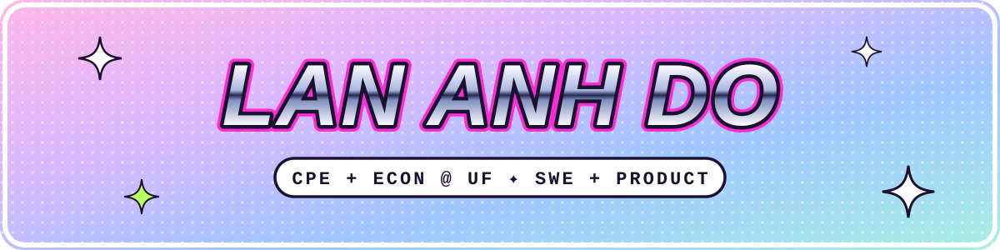

<!-- Profile README for Lan Anh Do -->

<h1 align="center">Hi friends, I'm Lan Anh! 👋</h1>

A **Computer Engineering + Economics** student at UF (class of 2027, GPA 3.94) who loves where **technology, systems & people** collide. I believe the best technology in the world is useless if nobody uses it and nobody understands why it matters.

🌐 **Portfolio:** [laba-ehehe.github.io](https://laba-ehehe.github.io)
📝 **Status:** open to **internships & new grad opportunities**

 

<table align="center">
<tr>
<td align="center"><b>3.94</b> GPA @ UF</td>
<td align="center"><b>−97%</b> investigation time at Intuit</td>
<td align="center"><b>1st 🏆</b> ShellHacks + AWS + Tiger Data</td>
<td align="center"><b>100+</b> students taught</td>
<td align="center"><b>14</b> fellowship projects delivered</td>
</tr>
</table>

---

## 🌸 Get to know me
- B.S. Computer Engineering + B.A. Economics @ University of Florida (Aug 2023 – May 2027)
- Certificates: Engineering Project Management · Econometric & Data Analysis
- Professional tech yapper :D
- Fun facts: matcha latte/boba addict 🧋, learning crochet 🧶, and yes, my hair used to be black but it's red now 🔥

## 💼 Experience
- **Security Software Engineering Intern, Intuit** (May – Aug 2026)
  Built an AI-powered identity lookup platform (MCP, Python, FastAPI, Spring Boot) for 20+ fraud investigators, cutting investigation time by **97%** and saving 200+ hours weekly. Also built an account-linking pipeline (Numaflow, EventBus, DynamoDB, Docker) that processes 5,000+ weekly sanctions alerts.
- **Teaching Assistant, University of Florida** (Aug 2024 – Present)
  Data Structures & Algorithms, Digital Logic, Computer Organization, Programming Fundamentals. Instructed 100+ students, boosted exam averages by **22%**, and developed course content for 1200+ students.
- **Software Engineering Fellow, Uber** (Feb – Aug 2025)
  Selected for the Uber Career Prep Fellowship (2.3% acceptance rate); solved 70+ technical interview problems 1:1 with Uber engineers.
- **Product Management Intern, M_Service (MoMo)** (May – Aug 2025)
  Built an automation tool on MoMo's lending platform (40M+ users) with Bazel and Jenkins, cutting lending rule deployment by **80%** and manual errors by 70%.
- **Product Management Intern, Nami Technology** (Jun – Aug 2024)
  Shipped an NLP conversation-analysis tool (scikit-learn, pandas, Flask, DynamoDB) adopted by 3 enterprise clients, reducing ticket resolution time by **38%**.

## 🚀 Projects
- **transPEAKtation** 🏆 *1st Place, ShellHacks (+ Best Use of AWS, Best Use of Tiger Data)*
  Event-aware routing platform (Python, FastAPI, Next.js, PyTorch, MongoDB, Tiger Data) that re-ranks routes before congestion forms. A 372K-parameter transformer cut forecast error by 33%, and a PPO load-balancer cut trip time up to 59% in a SUMO simulation. **[Demo video](https://youtu.be/maBHLULKMVc)** · **[GitHub](https://github.com/No-Way-Mo/transpeaktation)**
- **ChompCourse** *(Flask, React, Firebase, Expo, Selenium)*
  Personalized semester-by-semester course roadmaps for UF students, tested with 100+ users. **[GitHub](https://github.com/katieboetig/ChompCourse)**
- **SET Dumpy** *(Python, OpenCV, Arduino, LiDAR)*
  Trash-detecting robot built with a 27-person team: 90% navigation accuracy, 88% grasp success. **[GitHub](https://github.com/laba-ehehe/SET2023)**

**Side quests:** [Moodify](https://github.com/laba-ehehe/moodify) · [Ship Detection](https://github.com/laba-ehehe/ship-detection) · [Flower Classification & Car Detection](https://github.com/laba-ehehe/ann-flower-classification-car-detection) · [Supermarket Sales Analytics](https://github.com/laba-ehehe/supermarket-sales-analytics)

## 👑 Leadership
- **Director of Professional Development, UF Product Space** (Jun 2025 – Present): ran 6 workshops for 100+ members and a product fellowship matching 40+ fellows with 6 local startups (14 projects delivered).
- **Director of Awards, UF WiNGHacks** (Jul 2024 – Present): helped run UF's first hackathon focused on uplifting women, nonbinary people and gender minorities (120+ hackers, $10,000+ in prizes, 30+ judges).

---

## 🛠️ Skills

<b>Languages</b> 

<b>Frameworks</b> 

<b>Dev Tools</b> 

<b>AI / ML</b> 

---

## 🌸 Contact me

  
  &nbsp;&nbsp;
  
  &nbsp;&nbsp;
  

made by lan anh · ilysm ♥
